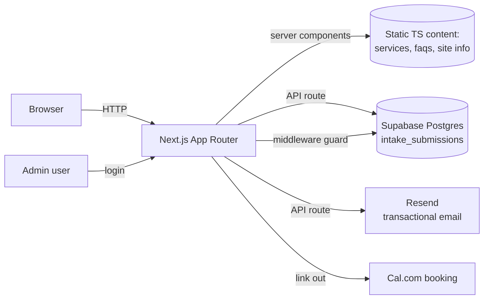
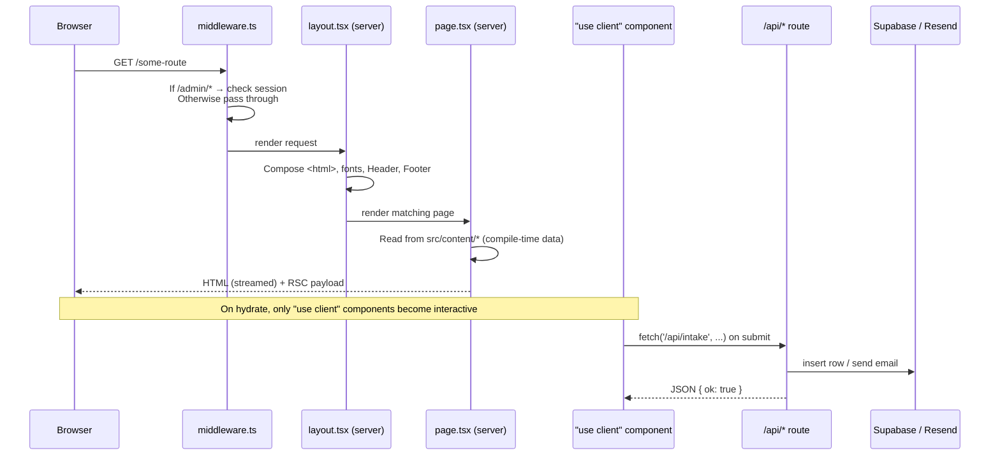
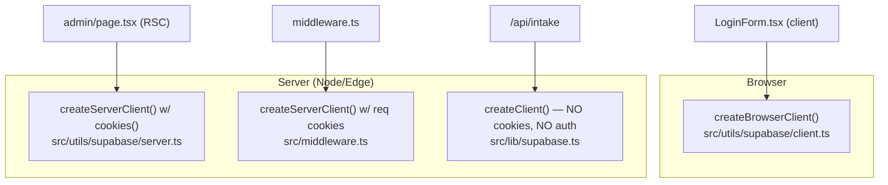
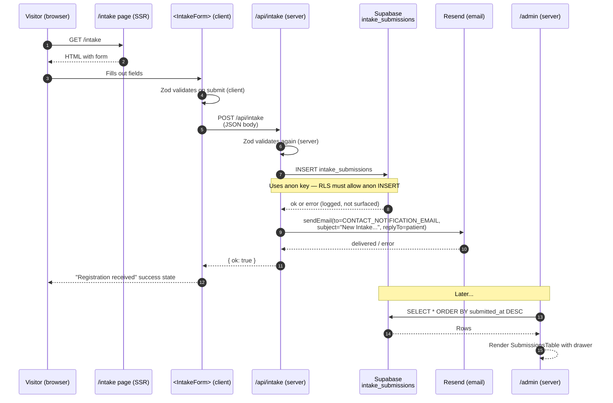
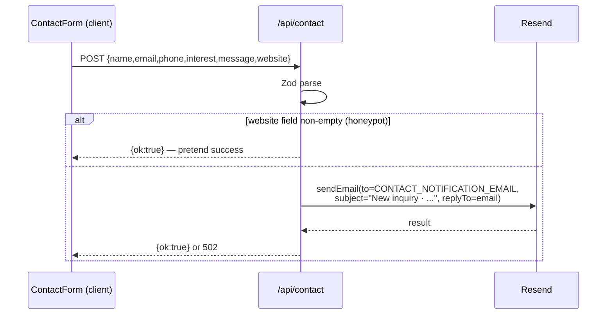
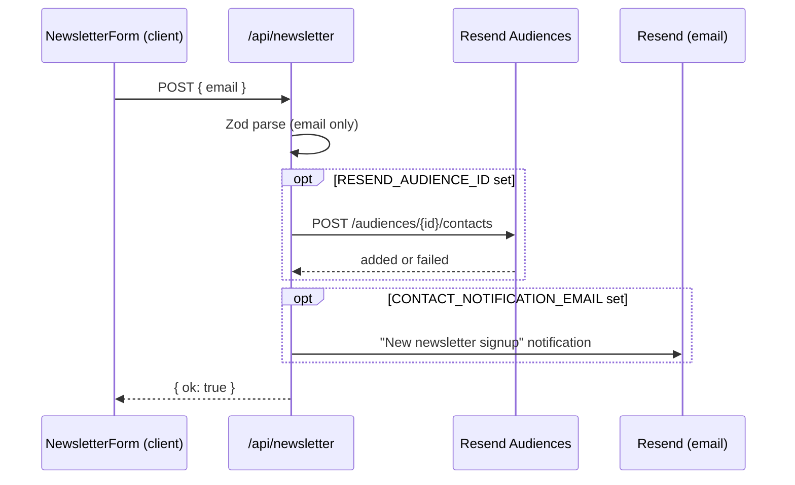

# Architecture — Hello You Wellness

A deep-dive reference for how the site is wired, top to bottom. Written for you to learn from — every section names concrete files and explains **why** a piece exists, not just what it does.

If you're new here, read sections 1–4 first for the mental model, then jump to whichever feature flow (section 13+) is most interesting.

---

## Table of contents

1. [At a glance](#1-at-a-glance)
2. [How a page reaches the user](#2-how-a-page-reaches-the-user)
3. [Tech stack](#3-tech-stack)
4. [Project layout map](#4-project-layout-map)
5. [The content layer](#5-the-content-layer)
6. [The data layer](#6-the-data-layer)
7. [The routing layer (App Router)](#7-the-routing-layer-app-router)
8. [The component layer](#8-the-component-layer)
9. [Library modules (`src/lib`)](#9-library-modules-srclib)
10. [Supabase — the three clients](#10-supabase--the-three-clients)
11. [Email via Resend](#11-email-via-resend)
12. [Forms — the react-hook-form + Zod pattern](#12-forms--the-react-hook-form--zod-pattern)
13. [Feature flow: Intake (new-patient registration)](#13-feature-flow-intake-new-patient-registration)
14. [Feature flow: Contact](#14-feature-flow-contact)
15. [Feature flow: Newsletter](#15-feature-flow-newsletter)
16. [Feature flow: Wellness quiz](#16-feature-flow-wellness-quiz)
17. [Feature flow: Booking (Cal.com)](#17-feature-flow-booking-calcom)
18. [Feature flow: Admin login & dashboard](#18-feature-flow-admin-login--dashboard)
19. [Middleware deep dive](#19-middleware-deep-dive)
20. [Trust boundaries / security model](#20-trust-boundaries--security-model)
21. [Environment variables reference](#21-environment-variables-reference)
22. [SEO & metadata pipeline](#22-seo--metadata-pipeline)
23. [Styling system](#23-styling-system)
24. [Deployment notes](#24-deployment-notes)
25. [How to extend](#25-how-to-extend)
26. [Known gaps / future work](#26-known-gaps--future-work)

---

## 1. At a glance

This is a **Next.js 16 App Router** site — the same Next.js framework most React devs know, but the App Router uses a different file layout and runs most components on the server by default.

At the highest level:

- **Frontend**: server-rendered React 19 pages styled with Tailwind 4. Components are server components unless they say `"use client"` at the top.
- **Backend**: a handful of API Route Handlers inside `src/app/api/**/route.ts` — thin HTTP endpoints that validate input with Zod, do one thing (insert a row, send an email), and return JSON.
- **Data**:
  - **Static content** (services, FAQs, testimonials, products) lives as TypeScript files under [src/content/](src/content/) and [src/data/](src/data/). No CMS, no database fetch. Edit a file, redeploy.
  - **Dynamic data** (patient intake submissions) lives in **Supabase Postgres**, one table: `intake_submissions`.
- **Auth**: Supabase Auth (email + password) guards the admin dashboard. Enforced by Next middleware.
- **Email**: transactional email via **Resend** (contact form, intake submission notifications, newsletter signups, quiz-lead emails).
- **Booking**: off-platform on **Cal.com** — the site never handles calendars itself; it just links to the right Cal.com URL.
- **Payments**: not implemented yet. The store (`src/data/products.ts`) has an optional `paymentLink` field designed for Stripe Payment Links, but nothing is wired up.



---

## 2. How a page reaches the user

Understanding this one flow unlocks most of the rest.



Key points:

- **Most pages are server components.** They read from `src/content/*` at request time (which is essentially compile time for static content), render HTML, and ship a tiny bit of RSC payload. No client JS is needed to show a service page.
- **Client islands** (forms, dropdowns, the quiz) opt in with `"use client"`. They're hydrated in the browser and talk to the backend through `fetch` calls to our own `/api/*` routes.
- **API routes are serverless functions.** On Vercel they spin up per request. They don't share memory — every file you see under `src/app/api/*/route.ts` is a standalone HTTP handler.

---

## 3. Tech stack

Defined in [package.json](package.json).

| Concern | Library | Why it's here |
|---|---|---|
| Framework | `next@16.2.3` | App Router, server components, edge middleware, file-based routing |
| UI runtime | `react@19.2.4` + `react-dom` | Server components require React 19 |
| Styling | `tailwindcss@4` via `@tailwindcss/postcss` | Utility-first CSS. v4 is config-less — theme lives in [globals.css](src/app/globals.css) via `@theme inline` |
| Class helpers | `clsx` + `tailwind-merge` → wrapped in [cn()](src/lib/utils.ts) | Safely merge conditional Tailwind classes |
| Forms | `react-hook-form` + `@hookform/resolvers/zod` | Uncontrolled inputs, good perf, plus Zod-backed validation |
| Validation | `zod@4` | One schema defines both client-side errors **and** server-side parsing |
| Auth + DB | `@supabase/supabase-js` + `@supabase/ssr` | Postgres, auth, cookie-based SSR sessions |
| Types | `typescript@5` | End-to-end typing including inferred form types via `z.infer` |
| Lint | `eslint@9` + `eslint-config-next` | Matches Next's defaults |

Notably **not** used:
- No state manager (Redux/Zustand/Jotai) — React state is enough.
- No UI kit (shadcn, MUI, Radix) — components are hand-rolled in [src/components/ui/](src/components/ui/).
- No fetching library (SWR, TanStack Query) — we server-render or use native `fetch` in client components.
- No ORM — direct Supabase client calls.

### ⚠️ Read before writing code

[AGENTS.md](AGENTS.md) warns that Next.js 16 has breaking changes vs prior versions. When you see unfamiliar syntax, check `node_modules/next/dist/docs/` before guessing. Examples of things that are newer/different:

- `export const dynamic`, `export const revalidate` for caching.
- `cookies()` and `headers()` are **async** — notice the `await cookies()` in [src/app/admin/page.tsx](src/app/admin/page.tsx).
- Dynamic route params arrive as a Promise — see [src/app/services/[slug]/page.tsx](src/app/services/[slug]/page.tsx):
  ```ts
  type Props = { params: Promise<{ slug: string }> };
  const { slug } = await params;
  ```

---

## 4. Project layout map

```
medSpaa/
├── .env.example            # Template for env vars (see §21 for gaps)
├── AGENTS.md               # Project rules aimed at AI assistants
├── CLAUDE.md               # Imports AGENTS.md
├── next.config.ts          # Only tweak: allow images from Unsplash
├── package.json
├── tsconfig.json
├── docs/
│   ├── 01-tech-stack.md    # Pre-existing overview docs
│   ├── 02-routing-and-layout.md
│   ├── ...
│   └── ARCHITECTURE.md     # ← This file
├── public/                 # Served at /  (images, favicon)
└── src/
    ├── middleware.ts       # Runs on every /admin/* request
    ├── app/                # ROUTES — every folder maps to a URL
    │   ├── layout.tsx       # Root HTML shell, fonts, Header, Footer
    │   ├── page.tsx         # Home (/)
    │   ├── globals.css      # Tailwind import + theme tokens + keyframes
    │   ├── sitemap.ts       # Generated /sitemap.xml
    │   ├── robots.ts        # Generated /robots.txt
    │   ├── not-found.tsx    # 404 page
    │   ├── (public pages)/  # about, services, store, faq, contact, etc.
    │   ├── admin/           # Protected dashboard
    │   └── api/             # HTTP endpoints
    │       ├── contact/route.ts
    │       ├── intake/route.ts
    │       ├── newsletter/route.ts
    │       └── quiz/route.ts
    ├── components/          # Reusable UI, grouped by feature
    │   ├── ui/              # Primitives: Button, Container, SectionHeading, …
    │   ├── layout/          # Header, Footer, SkipLink, StickyBookCta
    │   ├── home/            # Hero, Services preview, Testimonials, etc.
    │   ├── services/        # Per-service content (IV builder, weight-loss, …)
    │   ├── intake/          # The big intake form
    │   ├── forms/           # ContactForm, NewsletterForm
    │   ├── admin/           # LoginForm, SubmissionsTable
    │   ├── faq/             # FaqAccordion
    │   ├── quiz/            # WellnessQuiz
    │   ├── store/           # Product cards, catalog
    │   ├── testimonials/    # Testimonial grids
    │   ├── location/        # Google Maps embed
    │   └── json-ld.tsx      # Injects JSON-LD <script> tags for SEO
    ├── content/             # STATIC SITE DATA (edit these, redeploy)
    │   ├── site.ts          # Brand, address, hours, phone, URLs
    │   ├── navigation.ts    # mainNav + footerGroups
    │   ├── services.ts      # The 5 service pages' content
    │   ├── faqs.ts          # All FAQ Q&As
    │   ├── testimonials.ts
    │   ├── policies.ts
    │   └── quiz.ts          # Quiz steps + scoring weights
    ├── data/
    │   └── products.ts      # Store catalog
    ├── lib/                 # Small shared helpers, zero UI
    │   ├── supabase.ts      # Plain (non-SSR) Supabase client
    │   ├── email.ts         # sendEmail() via Resend + escapeHtml()
    │   ├── intake-schema.ts # Zod schema for intake form
    │   ├── faq-schema.ts    # FAQ JSON-LD helper
    │   ├── schema.ts        # LocalBusiness JSON-LD helper
    │   ├── seo.ts           # createMetadata() — builds <head> metadata
    │   ├── booking.ts       # Maps service slug → Cal.com URL
    │   └── utils.ts         # cn() class-merge helper
    └── utils/
        └── supabase/        # THREE different Supabase clients (see §10)
            ├── client.ts    # Browser
            ├── server.ts    # Server components / API routes
            └── middleware.ts # Edge middleware (currently unused internally)
```

### Why `src/content` vs `src/data` vs `src/lib`?

A mental model that will save you hours:

- **`src/content/`** — *What the site says.* Copy, headings, service descriptions, FAQ text. Marketing-owned material. A non-dev could almost edit this (except it's TypeScript).
- **`src/data/`** — *What the site sells.* The product catalog. Structurally similar to content but kept separate because products have real prices, SKUs, payment links — they feel more like a database table.
- **`src/lib/`** — *How the site works.* Pure functions, no JSX. Schemas, validators, formatters, API helpers. Reusable across client and server.
- **`src/utils/`** — Same idea as `lib/` but currently reserved for the Supabase client factories. If we end up with more infra-flavored helpers (rate-limit, crypto), they'd go here.

---

## 5. The content layer

These files make the site mostly "text-driven" — you edit a TypeScript file, the site updates. No database query, no CMS fetch, no cache-bust.

| File | Shape | Consumed by |
|---|---|---|
| [src/content/site.ts](src/content/site.ts) | `const site = { name, url, phone, address, hours, social, trustBadges }` | Everywhere — header, footer, meta, JSON-LD, contact page |
| [src/content/navigation.ts](src/content/navigation.ts) | `mainNav[]`, `footerGroups[]` | [Header](src/components/layout/header.tsx), [Footer](src/components/layout/footer.tsx) |
| [src/content/services.ts](src/content/services.ts) | Array of `ServiceContent` with a strict union `ServiceSlug` | Services page, `[slug]` dynamic page, home preview, sitemap |
| [src/content/faqs.ts](src/content/faqs.ts) | `FaqItem[]`, plus `faqsByIds()` helper | FAQ page, each service page's FAQ block, JSON-LD |
| [src/content/testimonials.ts](src/content/testimonials.ts) | Testimonial quotes | Home, service pages |
| [src/content/policies.ts](src/content/policies.ts) | Long policy copy | `/policies` page |
| [src/content/quiz.ts](src/content/quiz.ts) | Quiz steps + `recommendService(weights)` function | Quiz component + `/api/quiz` |

### Pattern: a string-literal union as the source of truth

In `services.ts` you'll see:

```ts
export type ServiceSlug =
  | "assisted-weight-loss"
  | "aesthetics-cosmetics"
  | "iv-therapy"
  | "build-your-own-iv"
  | "peptide-therapy";
```

This type is imported by [lib/booking.ts](src/lib/booking.ts), the dynamic route, the quiz API, and the sitemap. Adding a new slug here surfaces a TypeScript error everywhere the compiler needs you to handle it — a cheap but powerful discipline. Think of it as "schema" at the type level.

---

## 6. The data layer

Only one file: [src/data/products.ts](src/data/products.ts).

```ts
export type Product = {
  name: string;
  description: string;
  category: ProductCategory;
  image: string;
  badge: string | null;
  onSale: boolean;
  originalPrice?: number | null;
  salePrice?: number | null;
  price?: number | null;
  paymentLink?: string;   // ← Stripe Payment Link goes here when wired
};
```

Read by [StoreCatalog](src/components/store/store-catalog.tsx), rendered through [ProductCard](src/components/store/product-card.tsx). Category filter in the URL (`?category=Peptides...`) is read with `useSearchParams`.

When you're ready to accept money, the path is:

1. Create a Stripe Payment Link for each product.
2. Paste the URL into `paymentLink` on that product.
3. The "Buy" button on [ProductCard](src/components/store/product-card.tsx) already uses that field.

No webhooks, no DB rows — Stripe owns the order ledger.

---

## 7. The routing layer (App Router)

The App Router is **file-based**: each folder inside `src/app/` with a `page.tsx` becomes a URL. A few special filenames have meaning.

### Special files

| File | Role |
|---|---|
| [src/app/layout.tsx](src/app/layout.tsx) | Root layout. Wraps the entire site with `<html>`, loads Google Fonts, injects LocalBusiness JSON-LD, renders [Header](src/components/layout/header.tsx), [Footer](src/components/layout/footer.tsx), and [StickyBookCta](src/components/layout/sticky-book-cta.tsx). |
| [src/app/page.tsx](src/app/page.tsx) | The home page. Composes [HeroSection](src/components/home/hero-section.tsx), [ServicesMarquee](src/components/home/services-marquee.tsx), [ServicesPreview](src/components/home/services-preview.tsx), etc. |
| [src/app/not-found.tsx](src/app/not-found.tsx) | 404 page |
| [src/app/globals.css](src/app/globals.css) | The **only** global CSS. Tailwind is imported here. Keyframes too. |
| [src/app/sitemap.ts](src/app/sitemap.ts) | Exports a function that returns sitemap entries. Next turns it into `/sitemap.xml`. |
| [src/app/robots.ts](src/app/robots.ts) | Exports a function. Next turns it into `/robots.txt`. |
| [src/app/favicon.ico](src/app/favicon.ico) | Picked up automatically. |
| [src/middleware.ts](src/middleware.ts) | Runs at the edge for `/admin/*`. See §19. |

### Public routes (all static/SSG)

| URL | File | Notes |
|---|---|---|
| `/` | [app/page.tsx](src/app/page.tsx) | Home — stacks the marketing sections |
| `/about` | [app/about/page.tsx](src/app/about/page.tsx) | About + team story |
| `/services` | [app/services/page.tsx](src/app/services/page.tsx) | Lists all 5 services by mapping over `services` |
| `/services/[slug]` | [app/services/[slug]/page.tsx](src/app/services/[slug]/page.tsx) | Dynamic route. `generateStaticParams` pre-renders all 5 slugs at build. |
| `/store` | [app/store/page.tsx](src/app/store/page.tsx) | Product catalog + category filter |
| `/faq` | [app/faq/page.tsx](src/app/faq/page.tsx) | Global FAQ + FAQPage JSON-LD |
| `/quiz` | [app/quiz/page.tsx](src/app/quiz/page.tsx) | Hosts [WellnessQuiz](src/components/quiz/wellness-quiz.tsx) |
| `/testimonials` | [app/testimonials/page.tsx](src/app/testimonials/page.tsx) | |
| `/policies` | [app/policies/page.tsx](src/app/policies/page.tsx) | Privacy + terms |
| `/contact` | [app/contact/page.tsx](src/app/contact/page.tsx) | Contact info — see §14 for the orphaned form note |
| `/intake` | [app/intake/page.tsx](src/app/intake/page.tsx) | Hosts [IntakeForm](src/components/intake/intake-form.tsx) |
| `/client-portal` | [app/client-portal/page.tsx](src/app/client-portal/page.tsx) | Landing page w/ intake CTA + external portal link |
| `/book` | [app/book/page.tsx](src/app/book/page.tsx) | Aggregates Cal.com links by service |

### Protected routes

| URL | File |
|---|---|
| `/admin/login` | [app/admin/login/page.tsx](src/app/admin/login/page.tsx) |
| `/admin` | [app/admin/page.tsx](src/app/admin/page.tsx) (intake submissions dashboard) |

### API routes

| URL | File | Method | Purpose |
|---|---|---|---|
| `/api/contact` | [route.ts](src/app/api/contact/route.ts) | POST | Emails contact form submission to the clinic |
| `/api/intake` | [route.ts](src/app/api/intake/route.ts) | POST | Inserts row into Supabase + emails notification |
| `/api/newsletter` | [route.ts](src/app/api/newsletter/route.ts) | POST | Adds email to Resend audience + notifies |
| `/api/quiz` | [route.ts](src/app/api/quiz/route.ts) | POST | Notifies team + emails the lead their result |

Every API route exports an HTTP-method-named function (`POST`), parses JSON, validates with Zod, and returns `Response.json(...)`.

---

## 8. The component layer

Grouped by feature so you can find related pieces together.

### Primitives: [src/components/ui/](src/components/ui/)

The design system. Don't ship a new look without coming through here.

- [`<Button>`](src/components/ui/button.tsx) — polymorphic button/link. `variant` and `size` props.
- [`<Container>`](src/components/ui/container.tsx) — max-width + responsive padding wrapper.
- [`<SectionHeading>`](src/components/ui/section-heading.tsx) — eyebrow + headline + description. Applies the dusty-rose accent treatment used across the site.
- [`<TrustChip>`](src/components/ui/trust-chip.tsx) — little pill with a colored dot. Used on service hero ("Medical oversight", "SW Miami").
- [`<Reveal>`](src/components/ui/reveal.tsx) — fade-and-rise animation wrapper.
- [`<CountUp>`](src/components/ui/count-up.tsx) — animate a number counting up.

### Layout: [src/components/layout/](src/components/layout/)

- [`<Header>`](src/components/layout/header.tsx) — sticky top bar, nav dropdowns, mobile drawer, Book Now CTA that fades in after the hero scrolls off-screen (IntersectionObserver on `#home-hero`).
- [`<Footer>`](src/components/layout/footer.tsx) — renders [`<NewsletterForm>`](src/components/forms/newsletter-form.tsx) + [footerGroups](src/content/navigation.ts).
- [`<SkipLink>`](src/components/layout/skip-link.tsx) — a11y "Skip to main content" link.
- [`<StickyBookCta>`](src/components/layout/sticky-book-cta.tsx) — mobile-only floating CTA bar.

### Home: [src/components/home/](src/components/home/)

Every strip of the home page is its own file. [page.tsx](src/app/page.tsx) just composes them.

### Services: [src/components/services/](src/components/services/)

Each service has a dedicated content component because the layouts diverge. The dynamic route at [app/services/[slug]/page.tsx](src/app/services/[slug]/page.tsx) branches on slug and renders the right one:

- [`<WeightLossContent>`](src/components/services/weight-loss-content.tsx)
- [`<AestheticsContent>`](src/components/services/aesthetics-content.tsx)
- [`<IvTherapyContent>`](src/components/services/iv-therapy-content.tsx)
- [`<ByoIvContent>`](src/components/services/byo-iv-content.tsx) + [`<IVBuilder>`](src/components/services/iv-builder.tsx) (the nutrient picker)
- [`<PeptideContent>`](src/components/services/peptide-content.tsx)
- [`<IvAddOnsSection>`](src/components/services/iv-addons-section.tsx) — shared by IV + BYO pages
- [`<GettingStartedSection>`](src/components/services/getting-started-section.tsx) — shared three-step block
- [`<ServiceCard>`](src/components/services/service-card.tsx) — card used on `/services`

### Feature: forms, quiz, intake, admin, faq, store, testimonials, location

All self-contained and mostly client components. See the individual feature flow sections below for wiring detail.

---

## 9. Library modules (`src/lib`)

Small, pure helpers. Server-safe (no `window`, no React hooks).

| File | Exports | Purpose |
|---|---|---|
| [supabase.ts](src/lib/supabase.ts) | `supabase` | **Non-SSR** Supabase client created with `@supabase/supabase-js`. Used **only** in server-side code that doesn't need auth — currently just `/api/intake/route.ts`. See §10. |
| [email.ts](src/lib/email.ts) | `sendEmail({to, subject, html, replyTo})`, `escapeHtml(s)` | Thin wrapper over the Resend HTTP API. Returns `{delivered, reason}` — caller decides how to handle `not-configured` vs `error`. |
| [intake-schema.ts](src/lib/intake-schema.ts) | `intakeSchema`, `type IntakeFormData` | Big Zod schema for the intake form. Shared between client (resolver) and server (API route). |
| [schema.ts](src/lib/schema.ts) | `localBusinessJsonLd()` | Builds schema.org LocalBusiness JSON-LD from `site`. Injected by the root layout. |
| [faq-schema.ts](src/lib/faq-schema.ts) | `faqPageJsonLd(items)` | Builds FAQPage JSON-LD from any FAQ list. |
| [seo.ts](src/lib/seo.ts) | `createMetadata({title, description, path, image?})` | Page metadata factory — OpenGraph, Twitter, canonical. Every page that exports `metadata` goes through here. |
| [booking.ts](src/lib/booking.ts) | `bookingUrlForServiceSlug(slug)` | Maps service slug → the right Cal.com link. One place to change if Cal URLs move. |
| [utils.ts](src/lib/utils.ts) | `cn(...)` | `twMerge(clsx(inputs))`. Safely merges conditional Tailwind class strings. |

---

## 10. Supabase — the three clients

This is the piece most likely to confuse you at first. **We use Supabase three different ways** because the browser, a React Server Component, and Edge middleware all have different rules for reading/writing cookies.



### 10a. Browser client — [src/utils/supabase/client.ts](src/utils/supabase/client.ts)

```ts
createBrowserClient(NEXT_PUBLIC_SUPABASE_URL, NEXT_PUBLIC_SUPABASE_PUBLISHABLE_KEY)
```

Used by [LoginForm](src/components/admin/login-form.tsx) to call `supabase.auth.signInWithPassword(...)`. The `@supabase/ssr` browser client knows how to persist the session into cookies that the server can later read — that's the whole point of this package vs the plain `supabase-js`.

### 10b. Server client — [src/utils/supabase/server.ts](src/utils/supabase/server.ts)

```ts
createServerClient(url, key, {
  cookies: {
    getAll: () => cookieStore.getAll(),
    setAll: (cookiesToSet) => ...,
  }
})
```

Takes a `cookies()` result from Next and wires it up so Supabase can read the auth cookie on the request and refresh it if needed. Used by the server component at [src/app/admin/page.tsx](src/app/admin/page.tsx) to ask "who is logged in?" and then query `intake_submissions`.

The `try/catch` around `cookieStore.set()` is deliberate: in RSCs you can't mutate response cookies, so we swallow the error and rely on middleware (§19) to refresh the session cookie.

### 10c. Middleware client — [src/utils/supabase/middleware.ts](src/utils/supabase/middleware.ts)

Variant of the server client that wires into the edge middleware's request/response cookie API. **Note:** this file exists but is currently unused — [src/middleware.ts](src/middleware.ts) inlines its own server client. You can either delete `src/utils/supabase/middleware.ts` or refactor `middleware.ts` to use it. Not urgent.

### 10d. Plain client — [src/lib/supabase.ts](src/lib/supabase.ts)

```ts
createClient(url, key)   // from @supabase/supabase-js — NOT @supabase/ssr
```

No cookies, no session. This is the "anonymous" client: any query you make is authenticated as the publishable/anon key. It's used from [src/app/api/intake/route.ts](src/app/api/intake/route.ts) to insert an intake submission **on behalf of an unauthenticated site visitor.**

> 🚨 **Because `/api/intake` uses the anon key, your Supabase Row Level Security (RLS) policies on `intake_submissions` must allow `INSERT` for `anon`.** Otherwise silent failures: the API route logs the error and still returns `{ok: true}` (see §13). Double-check your RLS rules in the Supabase dashboard.

### The `intake_submissions` table

Field names, inferred from [src/app/api/intake/route.ts](src/app/api/intake/route.ts#L25-L62) and [src/components/admin/submissions-table.tsx](src/components/admin/submissions-table.tsx#L7-L46):

```sql
create table intake_submissions (
  id uuid primary key default gen_random_uuid(),
  submitted_at timestamptz default now(),
  registration_date text,
  full_name text,
  date_of_birth text,
  address text,
  phone_number text,
  email text,
  employment_status text,
  employer text,
  taking_medications text,
  medications_list text,
  emergency_contact text,
  height text,
  weight text,
  drinks_alcohol text,
  smokes_cigarettes text,
  recreational_drugs text,
  pre_existing_conditions text,
  pre_existing_conditions_details text,
  diagnosed_diabetes text,
  diagnosed_thyroid text,
  diagnosed_pancreatitis text,
  medical_conditions_details text,
  family_history_illness text,
  family_history_details text,
  currently_pregnant text,
  trying_to_conceive text,
  currently_breastfeeding text,
  last_blood_lab_work text,
  last_blood_pressure_date text,
  last_blood_pressure_results text,
  covid_vaccination_status text,
  under_physician_supervision text,
  reason_for_visit text,
  services_interested text[],   -- array of strings (multi-select)
  how_did_you_hear text,
  signature text,
  notes text                    -- admin-only (not written by the form)
);
```

RLS policies you should have (conceptually):
- `anon` can `INSERT` — so visitors can submit.
- `authenticated` can `SELECT` — so logged-in admins can read.
- No one can `UPDATE`/`DELETE` via the API layer (leave `notes` manual in the dashboard for now).

---

## 11. Email via Resend

Everything runs through [sendEmail()](src/lib/email.ts):

```ts
export async function sendEmail({to, subject, html, replyTo}): Promise<EmailResult> {
  const apiKey = process.env.RESEND_API_KEY;
  const from = process.env.CONTACT_FROM_EMAIL;

  if (!apiKey || !from) {
    return { delivered: false, reason: "not-configured" };   // silent skip
  }

  const res = await fetch("https://api.resend.com/emails", {
    method: "POST",
    headers: { "Content-Type": "application/json", Authorization: `Bearer ${apiKey}` },
    body: JSON.stringify({ from, to, subject, html, ...(replyTo ? {reply_to: replyTo} : {}) }),
  });
  ...
}
```

Three important design choices:

1. **Silent skip if not configured.** If `RESEND_API_KEY` or `CONTACT_FROM_EMAIL` is missing, the function logs a warning and returns `not-configured` — it doesn't throw. Callers treat that as "ok, we did what we could." Upside: preview deploys don't explode. Downside: if you forget to set the env var in prod, submissions disappear into the log (see §20).
2. **No templating engine.** HTML is handcrafted inline with `escapeHtml()` around every user-provided value. Deliberate — this site doesn't need MJML complexity.
3. **`reply_to`** is set to the sender's email so replying in your inbox talks to the customer, not to `no-reply@...`.

### Audience sync (newsletter only)

[/api/newsletter](src/app/api/newsletter/route.ts) additionally calls `POST /audiences/:id/contacts` to add the email to a Resend audience, if `RESEND_AUDIENCE_ID` is set. Independent from `sendEmail`.

---

## 12. Forms — the react-hook-form + Zod pattern

Every form on the site follows the same six-step recipe. Learn it once, recognize it everywhere.

```tsx
"use client";
import { useForm } from "react-hook-form";
import { zodResolver } from "@hookform/resolvers/zod";
import { mySchema, type MyFormData } from "@/lib/my-schema";

export function MyForm() {
  // 1. Wire Zod → RHF so validation errors appear under fields
  const { register, handleSubmit, formState: { errors, isSubmitting } } =
    useForm<MyFormData>({ resolver: zodResolver(mySchema) });

  // 2. Submit handler — fetch the API route
  async function onSubmit(data: MyFormData) {
    const res = await fetch("/api/something", {
      method: "POST",
      headers: { "Content-Type": "application/json" },
      body: JSON.stringify(data),
    });
    const json = await res.json();
    if (!json.ok) return setError(json.message);
    setSuccess(true);
  }

  // 3. Render. {...register("field")} registers each input with RHF.
  return (
    <form onSubmit={handleSubmit(onSubmit)} noValidate>
      <input {...register("name")} />
      {errors.name && <p>{errors.name.message}</p>}
      ...
    </form>
  );
}
```

And on the server ([src/app/api/my/route.ts](src/app/api/my/route.ts)):

```ts
import { mySchema } from "@/lib/my-schema";

export async function POST(request: Request) {
  const parsed = mySchema.safeParse(await request.json());
  if (!parsed.success) {
    return Response.json({ ok: false, message: "Invalid form data." }, { status: 400 });
  }
  // parsed.data is fully typed and validated
}
```

**The Zod schema is imported by BOTH sides.** That's why `src/lib/intake-schema.ts` lives in `lib/` (shared code). Client validation exists for UX (instant feedback) but the server re-validates because you **must never trust the client.**

Examples in this codebase:
- [IntakeForm](src/components/intake/intake-form.tsx) ↔ [intake-schema.ts](src/lib/intake-schema.ts) ↔ [/api/intake](src/app/api/intake/route.ts)
- [ContactForm](src/components/forms/contact-form.tsx) ↔ inline schema ↔ [/api/contact](src/app/api/contact/route.ts)
- [NewsletterForm](src/components/forms/newsletter-form.tsx) ↔ inline schema ↔ [/api/newsletter](src/app/api/newsletter/route.ts)
- [WellnessQuiz](src/components/quiz/wellness-quiz.tsx) (no RHF — custom state) ↔ [/api/quiz](src/app/api/quiz/route.ts)

---

## 13. Feature flow: Intake (new-patient registration)

The flagship data path — and the only one that writes to the database.

### The path



### The 3 files that matter

1. **Schema** — [src/lib/intake-schema.ts](src/lib/intake-schema.ts). ~40 fields of medical/personal info, each with a Zod validator. Shared by form + API.
2. **Form** — [src/components/intake/intake-form.tsx](src/components/intake/intake-form.tsx). Uses `react-hook-form` + `zodResolver`. Conditionally shows follow-up textareas (e.g. "List medications" appears only if `takingMedications === "yes"`). Converts success to a big "Registration received" card.
3. **API** — [src/app/api/intake/route.ts](src/app/api/intake/route.ts). Validates, inserts (snake_case column names), builds an HTML table of every field, sends email with the visitor's email as `reply_to`.

### Noteworthy behaviors

- **Silent DB failures.** If the Supabase insert fails, the error is `console.error`'d but the API still returns `{ok: true}` and proceeds to email. Rationale: the email still reaches the clinic so the visit isn't lost, but you **must** watch server logs or harden this to surface errors. See §26.
- **If `CONTACT_NOTIFICATION_EMAIL` isn't set**, the API skips BOTH the insert **and** the email. That's a bug if Supabase is configured: you lose DB storage just because the email recipient wasn't configured. Worth fixing.
- **No confirmation email is sent to the patient.** They see the "Registration received" UI and that's it. If you want a receipt email, add a second `sendEmail({ to: data.email, ... })` call.
- **PHI on the wire.** This form collects protected health information (medications, diagnoses, pregnancy status). See §20.

---

## 14. Feature flow: Contact

### Current state: API exists, form is not embedded

[src/app/contact/page.tsx](src/app/contact/page.tsx) currently shows the full-bleed hero, phone/email/address, and call/Instagram buttons — but it does **not** render [`<ContactForm>`](src/components/forms/contact-form.tsx).

The `/api/contact` route is complete and tested (honeypot, Zod, Resend) but there's no visible UI sending to it.

### If you restore the form

Add this to [contact/page.tsx](src/app/contact/page.tsx) in the second `<section>`:

```tsx
import { ContactForm } from "@/components/forms/contact-form";

// ...
<section className="py-16">
  <Container className="max-w-3xl">
    {/* existing contact info */}
    <div className="mt-12 border-t border-line pt-12">
      <h2 className="font-display text-2xl text-ink">Send a message</h2>
      <div className="mt-6">
        <ContactForm />
      </div>
    </div>
  </Container>
</section>
```

### The API [src/app/api/contact/route.ts](src/app/api/contact/route.ts)

Flow:



Key techniques:

- **Honeypot field.** The form hides a `<input name="website">` via CSS. Real users don't fill it; bots often do. If it's populated, the server returns success without emailing.
- **Friendly `interest` labels.** `interestLabels[interest]` maps `"weight-loss"` → `"Assisted weight loss"` before composing the subject line.
- **No DB write.** Contact messages live in your inbox only.

---

## 15. Feature flow: Newsletter

Wired. [`<NewsletterForm>`](src/components/forms/newsletter-form.tsx) is rendered inside [Footer](src/components/layout/footer.tsx#L118) with `tone="dark"`.



Either env var alone works. If neither is set, signups are just `console.warn`'d.

---

## 16. Feature flow: Wellness quiz

The quiz is the most state-heavy client piece — a multi-step form with scoring.

### Content + scoring: [src/content/quiz.ts](src/content/quiz.ts)

Defines:
- `quizSteps[]` — each step has an `id`, `title`, `type: "single" | "multi"`, and `options[]`.
- Each option has `weights: Partial<Record<ServiceSlug, number>>` — "if the user picks this, add these points to each service."
- `recommendService(weights)` — the scoring function. Returns a `ServiceSlug`.

### Component: [src/components/quiz/wellness-quiz.tsx](src/components/quiz/wellness-quiz.tsx)

Pure `useState`, no RHF. Tracks:
- `view` — `{kind: "step", index}` or `{kind: "result", service}`.
- `answers` — `Record<stepId, string[]>`.

When the user finishes the last step, `recommendService(weights)` runs locally and the view flips to `{kind: "result"}`. A "Get my full plan" CTA then posts `{name, email, phone, answers, recommendation}` to `/api/quiz`.

### API: [src/app/api/quiz/route.ts](src/app/api/quiz/route.ts)

Unique because it sends **two** emails:
1. To the clinic (the lead).
2. To the visitor (their result, with a "Call / Message / Read more" button row).

If either fails, the user still sees a success state client-side — it's best-effort.

---

## 17. Feature flow: Booking (Cal.com)

The simplest flow and worth understanding because it's easy to overengineer.

**The site does not handle bookings.** It links to Cal.com URLs. No webhooks, no DB, no availability state.

- [src/lib/booking.ts](src/lib/booking.ts) maps a `ServiceSlug` to the right Cal.com URL.
- [src/content/site.ts](src/content/site.ts) has `site.bookingUrl` as the general fallback.
- The `bookingUrlForServiceSlug(slug)` helper is used inside [app/services/[slug]/page.tsx](src/app/services/[slug]/page.tsx) to pick the right URL for each service page's "Book a consultation" button.
- [app/book/page.tsx](src/app/book/page.tsx) renders a grid of four service-specific buttons.

If you later want in-house booking (PostgreSQL availability slots, Stripe deposit on confirm), the `/book` route is where that would live. For now: Cal.com owns it.

---

## 18. Feature flow: Admin login & dashboard

### Login flow

```mermaid
sequenceDiagram
  participant B as Browser
  participant MW as middleware.ts
  participant Login as /admin/login (SSR)
  participant LF as <LoginForm> (client)
  participant SB as Supabase Auth
  participant Dash as /admin (SSR)

  B->>MW: GET /admin
  MW->>SB: getUser() using request cookies
  SB-->>MW: no user
  MW-->>B: 307 → /admin/login

  B->>Login: GET /admin/login
  Login-->>B: HTML + LoginForm

  B->>LF: submit email + password
  LF->>SB: signInWithPassword()
  SB-->>LF: session cookie set (via createBrowserClient)
  LF->>B: router.push('/admin'); router.refresh()

  B->>MW: GET /admin
  MW->>SB: getUser() — sees cookie now
  SB-->>MW: user
  MW-->>Dash: allow
  Dash->>SB: select intake_submissions
  SB-->>Dash: rows
  Dash-->>B: HTML with SubmissionsTable
```

### The 4 files that matter

- [src/middleware.ts](src/middleware.ts) — gatekeeper. Matches `/admin/:path*`. Redirects unauth'd users to `/admin/login`, and redirects already-authenticated users away from `/admin/login`.
- [src/app/admin/login/page.tsx](src/app/admin/login/page.tsx) — shell page, renders [`<LoginForm>`](src/components/admin/login-form.tsx).
- [src/components/admin/login-form.tsx](src/components/admin/login-form.tsx) — client component. Calls `supabase.auth.signInWithPassword()` via the browser client.
- [src/app/admin/page.tsx](src/app/admin/page.tsx) — server component. `await cookies()` → server Supabase client → checks user → queries table → renders [`<SubmissionsTable>`](src/components/admin/submissions-table.tsx).

### The dashboard — [src/components/admin/submissions-table.tsx](src/components/admin/submissions-table.tsx)

- Receives `initialData` from the server. No client-side fetching.
- Client-side filter on name/email/phone.
- Click a row → slides open a right-side drawer with every field grouped by section (Personal, Medications, Medical, Reproductive, Labs, Visit, Signature).
- "Sign out" button calls `supabase.auth.signOut()` via the browser client, then `router.push('/admin/login')`.
- `robots: { index: false }` on both admin pages — search engines skip them.

### Creating an admin user

Since there's no self-serve signup, you create admin users in the **Supabase dashboard** → Authentication → Users → "Add user" → choose email+password. That's it. Any user in that table can access `/admin`.

---

## 19. Middleware deep dive

[src/middleware.ts](src/middleware.ts):

```ts
export const config = {
  matcher: ["/admin/:path*"],   // only runs on /admin and below
};

export async function middleware(request: NextRequest) {
  // Build a Supabase server client wired to request + response cookies
  const supabase = createServerClient(url, key, { cookies: {...} });

  const { data: { user } } = await supabase.auth.getUser();

  if (pathname.startsWith("/admin") && pathname !== "/admin/login") {
    if (!user) return NextResponse.redirect("/admin/login");
  }
  if (pathname === "/admin/login" && user) {
    return NextResponse.redirect("/admin");
  }
  return supabaseResponse;
}
```

Why this shape:

1. **`matcher` keeps it cheap.** Middleware runs at the edge on every matching request. Scoping to `/admin/:path*` means the 98% of traffic that's visiting `/services` or `/about` skips this entirely.
2. **Calling `supabase.auth.getUser()` refreshes the session cookie.** That's what the cookie-getter/setter dance is for: if the access token is about to expire, Supabase rotates it and we write the new cookie on the response. Without this, sessions would expire mid-visit.
3. **Two-way redirect.** Unauth'd → `/admin/login`. Auth'd + visiting login → `/admin`. Both improve UX.

The file [src/utils/supabase/middleware.ts](src/utils/supabase/middleware.ts) is an unused alternative implementation. Safe to delete or collapse.

---

## 20. Trust boundaries / security model

The rule of thumb: **anything with `"use client"` is visitor-controllable. Re-validate on the server.**

| Layer | Runs | Trust level | What it should do |
|---|---|---|---|
| Client components | Browser, user's machine | Hostile | UX — don't store secrets, assume bypassable |
| Server components / RSC | Server | Trusted | Read session, query DB |
| API routes | Server | Trusted | Validate inputs with Zod, perform writes, send email |
| Middleware | Edge | Trusted | Gate access, refresh session cookies |
| Supabase RLS | DB | Trusted enforcer | Final line — deny writes/reads that policy doesn't allow |

### Concrete concerns in this codebase

1. **PHI on the wire.** The intake form collects protected health info (medications, diagnoses, pregnancy, BP). It's transmitted HTTPS (fine) and stored in Supabase (fine). If you're operating in the US, **this is HIPAA territory** and you should:
   - Sign a BAA with Supabase (paid plan).
   - Sign a BAA with Resend (paid plan) — email bodies currently contain PHI.
   - Sign a BAA with your hosting provider (Vercel Pro + BAA, or self-host).
   - Restrict admin login to 2FA (Supabase Auth supports it; wire it on).
2. **Anon-key inserts.** `/api/intake` uses the anon key. Anyone hitting the endpoint can insert. The protections are:
   - Zod schema shape.
   - Your RLS policy: the insert goes through only if RLS allows it.
   - (Missing) Rate limiting. Right now a bot could fill your table. Consider adding an `Upstash/@vercel/kv` rate limiter keyed on IP.
3. **Honeypot on contact form only.** Intake form has no bot protection. Add a honeypot the same way contact does if you see spam.
4. **Silent failures.** Multiple API routes return `{ok: true}` even when Supabase or Resend fails — see §13 and §26. Users get a success screen but data may be lost. Improve by surfacing errors or at minimum logging to a monitored sink (e.g. Sentry).
5. **Publishable key is public.** `NEXT_PUBLIC_SUPABASE_PUBLISHABLE_KEY` is exposed in the browser bundle. That's expected — it's designed to be public. RLS is what protects your data, not the key. Never use the `service_role` key anywhere — it bypasses RLS entirely.

---

## 21. Environment variables reference

| Variable | Set in | Read by | Required for | Notes |
|---|---|---|---|---|
| `NEXT_PUBLIC_SITE_URL` | `.env.local`, Vercel | [site.ts](src/content/site.ts), [seo.ts](src/lib/seo.ts), sitemap, robots | Canonical URLs, OG tags | Must include protocol, no trailing slash. Defaults to `https://xlashbyyane.com` if unset. |
| `NEXT_PUBLIC_SUPABASE_URL` | Supabase project settings → API | [utils/supabase/client.ts](src/utils/supabase/client.ts), [server.ts](src/utils/supabase/server.ts), [middleware.ts](src/middleware.ts), [lib/supabase.ts](src/lib/supabase.ts) | Admin login, intake DB insert | **Missing from `.env.example`** — add it. |
| `NEXT_PUBLIC_SUPABASE_PUBLISHABLE_KEY` | Supabase → API → `publishable` (new name for `anon`) | Same as above | Admin login, intake DB insert | **Missing from `.env.example`** — add it. Safe to expose publicly. |
| `RESEND_API_KEY` | [resend.com](https://resend.com) → API keys | [lib/email.ts](src/lib/email.ts) | All transactional email | **Server-only.** Never prefix with `NEXT_PUBLIC_`. |
| `CONTACT_FROM_EMAIL` | You set | [lib/email.ts](src/lib/email.ts) | All transactional email | Must match a domain you've verified in Resend. Example: `Hello You <no-reply@helloyouwellness.com>`. |
| `CONTACT_NOTIFICATION_EMAIL` | You set | [api/contact](src/app/api/contact/route.ts), [api/intake](src/app/api/intake/route.ts), [api/newsletter](src/app/api/newsletter/route.ts), [api/quiz](src/app/api/quiz/route.ts) | Receiving form notifications | Where submissions go. Defaults to `info@helloyouwellness.com` in the example file. |
| `RESEND_AUDIENCE_ID` | Resend → Audiences | [api/newsletter](src/app/api/newsletter/route.ts) | Newsletter signups added to a list | Optional. Without it, newsletter only sends the notification email. |

### Gap: `.env.example` is incomplete

The current [.env.example](.env.example) lists the Resend and site-URL vars but **not** the Supabase vars. Fix by adding:

```bash
# Supabase — project URL and publishable (anon) key
NEXT_PUBLIC_SUPABASE_URL=https://YOUR-PROJECT.supabase.co
NEXT_PUBLIC_SUPABASE_PUBLISHABLE_KEY=
```

### Checking what's configured at runtime

Add a temporary diagnostic page or log at startup to see which env vars are present in prod. Vercel's project settings has a "Decrypt & copy" view for each deployment.

---

## 22. SEO & metadata pipeline

Three cooperating systems.

### 22a. `<head>` metadata via [createMetadata()](src/lib/seo.ts)

Next 16 uses a declarative `export const metadata: Metadata = {...}` (or `generateMetadata` for dynamic routes). Every page imports `createMetadata` and passes `title`, `description`, `path`:

```ts
export const metadata: Metadata = createMetadata({
  title: "Services",
  description: `...`,
  path: "/services",
});
```

That factory fills in:
- `metadataBase` (so relative URLs resolve).
- Canonical tag.
- OpenGraph + Twitter image cards.
- Site name + locale.
- `robots: { index: true, follow: true }`.

### 22b. JSON-LD structured data

[src/components/json-ld.tsx](src/components/json-ld.tsx) is a one-line component that stuffs a JSON blob into a `<script type="application/ld+json">`. It's injected two places:

- **Globally** from [layout.tsx](src/app/layout.tsx) with [localBusinessJsonLd()](src/lib/schema.ts) — MedicalClinic + LocalBusiness schema. Google uses this for map pins + knowledge panels.
- **Per-service** from [app/services/[slug]/page.tsx](src/app/services/[slug]/page.tsx) for weight-loss and aesthetics pages — a `Service` schema.
- **Per-FAQ** from [app/faq/page.tsx](src/app/faq/page.tsx) with [faqPageJsonLd()](src/lib/faq-schema.ts) — helps Google show "People also ask" results.

### 22c. Sitemap + robots

- [app/sitemap.ts](src/app/sitemap.ts) generates entries for every static route and every service slug. Next serves it at `/sitemap.xml`.
- [app/robots.ts](src/app/robots.ts) allows everything and points to the sitemap.
- Admin pages opt out via `metadata.robots = { index: false }`.

---

## 23. Styling system

Tailwind 4 + design tokens in CSS.

### [src/app/globals.css](src/app/globals.css) — the only global CSS

```css
@import "tailwindcss";

:root {
  --canvas: #f7f7f7;
  --surface: #ffffff;
  --ink: #212020;
  --chrome: #161616;
  --accent-soft: #e8e8e8;
  ...
}

@theme inline {
  --color-canvas: var(--canvas);
  --color-ink: var(--ink);
  --font-display: var(--font-fraunces), serif;
  --font-script: var(--font-alex-brush), serif;
  --radius-card: 1.25rem;
}
```

- `:root` holds raw CSS variables.
- `@theme inline { ... }` is the Tailwind 4 way to register those as utility classes — now `bg-canvas`, `text-ink`, `font-display`, `rounded-[var(--radius-card)]` all work.
- Keyframes (`rise`, `marquee`) and their utilities (`.animate-rise`, `.animate-marquee`) live here too.
- `@media (prefers-reduced-motion: reduce)` disables animations — a free accessibility win.

### Fonts

Loaded in [layout.tsx](src/app/layout.tsx) via `next/font/google`:
- **Plus Jakarta Sans** → `--font-jakarta` (body + UI)
- **Fraunces** → `--font-fraunces` (display headings)
- **Alex Brush** → `--font-alex-brush` (the script "accent word" flourish)

Apply with Tailwind utility classes (`font-display`, `font-script`, `font-ui`).

### The brand accent

The dusty-rose accent color `#E8B4A3` is used consistently for:
- Section kickers (small-caps + dash)
- Script accent words in headings
- Hover highlights on preview cards

It's **not** in the theme tokens — it's inline hex across ~30 places. If you ever want to rebrand, grep for `#E8B4A3` and replace, or promote it to `--accent` in the CSS variables.

---

## 24. Deployment notes

- **Target**: Vercel (zero config). `next build` → `.next/` → Vercel serves static pages from CDN, API routes as serverless functions, middleware at the edge.
- **Domain**: `xlashbyyane.com` (the `site.url` default). Configure in Vercel project → Settings → Domains.
- **Env vars** live in Vercel → Settings → Environment Variables. Mirror your `.env.local` there.
- **Preview deploys**: every push to a non-main branch becomes a preview URL. Because `sendEmail()` silently skips when env vars are missing, previews won't email you — useful. But if you want previews to be fully functional, duplicate env vars to the "Preview" environment.
- **`images.remotePatterns`** in [next.config.ts](next.config.ts) allows `images.unsplash.com`. If you use photos from another host, add it there — Next.js `<Image>` refuses to optimize unlisted origins.

---

## 25. How to extend

### Adding a new service

1. Add the slug to the union in [src/content/services.ts](src/content/services.ts):
   ```ts
   export type ServiceSlug =
     | "...existing..."
     | "new-service-slug";
   ```
2. Add a `ServiceContent` entry in the same file with all required fields (`title`, `summary`, `heroImage`, `benefits`, `idealFor`, `faqIds`, `gettingStartedSteps`, etc.).
3. If this service maps to a specific Cal.com URL, add a case in [src/lib/booking.ts](src/lib/booking.ts).
4. (Optional) Add a nav entry in [src/content/navigation.ts](src/content/navigation.ts) under `mainNav` → `Services` → `children`.
5. (Optional) If the service deserves its own layout like `WeightLossContent`, create a component in [src/components/services/](src/components/services/) and branch on the slug in [src/app/services/[slug]/page.tsx](src/app/services/[slug]/page.tsx).

The TypeScript compiler will surface any place you missed.

### Adding a new static page

1. Create `src/app/your-page/page.tsx`:
   ```tsx
   import type { Metadata } from "next";
   import { createMetadata } from "@/lib/seo";
   import { Container } from "@/components/ui/container";

   export const metadata: Metadata = createMetadata({
     title: "Your page",
     description: "...",
     path: "/your-page",
   });

   export default function YourPage() {
     return (
       <section className="py-16">
         <Container>...</Container>
       </section>
     );
   }
   ```
2. Add it to [sitemap.ts](src/app/sitemap.ts).
3. Link to it from the nav or footer in [src/content/navigation.ts](src/content/navigation.ts).

### Adding a new form + API route

1. Write the Zod schema in `src/lib/your-form-schema.ts`.
2. Create a client component in `src/components/forms/your-form.tsx` following the pattern in §12.
3. Create the server route at `src/app/api/your-form/route.ts`. Import the same schema, `safeParse` the body, perform the side effect, return JSON.
4. Render the form from whichever page needs it.

### Adding a new admin view

1. Create `src/app/admin/your-view/page.tsx` — it's automatically protected by middleware.
2. Use the server Supabase client:
   ```ts
   const cookieStore = await cookies();
   const supabase = createClient(cookieStore);
   const { data } = await supabase.from("your_table").select();
   ```
3. Pass `data` to a client component for interactivity.

---

## 26. Known gaps / future work

Items worth tackling, in rough priority order.

### Reliability

1. **Intake API returns `{ok:true}` on DB failure.** [src/app/api/intake/route.ts](src/app/api/intake/route.ts#L64). Improve by returning a 500 + admin alert, or at minimum log to Sentry/Logflare so you notice.
2. **Intake API skips DB insert when `CONTACT_NOTIFICATION_EMAIL` is unset.** [src/app/api/intake/route.ts](src/app/api/intake/route.ts#L16-L23). The early return bails out before the insert. Separate the concerns — insert always, email only when configured.
3. **No rate limiting.** Anyone can POST to `/api/intake`, `/api/contact`, `/api/newsletter`, `/api/quiz`. Add `@upstash/ratelimit` keyed on IP.
4. **No Sentry / error tracking.** `console.error` only surfaces in Vercel logs for ~4 days. Pipe errors to a monitored sink.

### Compliance (if you're operating for real patients)

5. **HIPAA**: confirm BAAs with Supabase, Resend, and Vercel. Email bodies currently contain PHI — this is likely not HIPAA-safe on a free Resend plan.
6. **Admin 2FA**: enable in Supabase Auth settings and require it on `/admin/*` accounts.
7. **Audit log**: add an `admin_audit_log` table and write a row every time an admin views a submission. Simple, cheap, compliance-friendly.

### UX

8. **Patient doesn't get a confirmation email** after submitting intake. Add a second `sendEmail({ to: data.email, ... })` with a short "thanks — we received your form" note.
9. **Contact form is not on the contact page.** Either delete [ContactForm](src/components/forms/contact-form.tsx) + [/api/contact](src/app/api/contact/route.ts) or restore the form on [/contact](src/app/contact/page.tsx).
10. **Store `paymentLink` field is empty for all products** — wire up Stripe Payment Links to start accepting money.

### Cleanup

11. Unused file: [src/utils/supabase/middleware.ts](src/utils/supabase/middleware.ts). Either use it from `middleware.ts` or remove it.
12. `.env.example` is missing the Supabase vars. Add them so future-you doesn't boot a dev environment confused about why admin login 500s.
13. The brand accent `#E8B4A3` is inlined ~30 places. Promote it to a CSS variable in [globals.css](src/app/globals.css).

---

## Appendix: glossary

- **RSC** — React Server Component. Renders on the server, ships HTML + a tiny RSC payload. Cannot use hooks, `window`, or event handlers.
- **Client component** — any file with `"use client"` at top. Hydrated in the browser, full React semantics.
- **API route** — server-only HTTP handler at `src/app/**/route.ts`. Exports `GET`, `POST`, etc.
- **Middleware** — runs at Vercel's edge before the request reaches your pages. Good for auth gates, header rewrites.
- **RLS** — Row Level Security. Postgres policies that filter which rows a given auth role can read/write. Your last line of defense when using the anon key.
- **Anon key / publishable key** — Supabase's public API key. Goes in client bundles. Subject to RLS.
- **Service role key** — Supabase's super-admin key. Bypasses RLS. **Never put it in client code** and this project doesn't use it.
- **Zod resolver** — `@hookform/resolvers/zod` glue so react-hook-form speaks Zod for validation errors.
- **Cal.com** — external calendar SaaS. We just link out.
- **Resend** — transactional email SaaS. Alternative to Postmark/Mailgun/SendGrid.

---

*Last reviewed: 2026-04-22. When you substantially change the data model, middleware, or add a new feature flow, update the relevant section above.*
